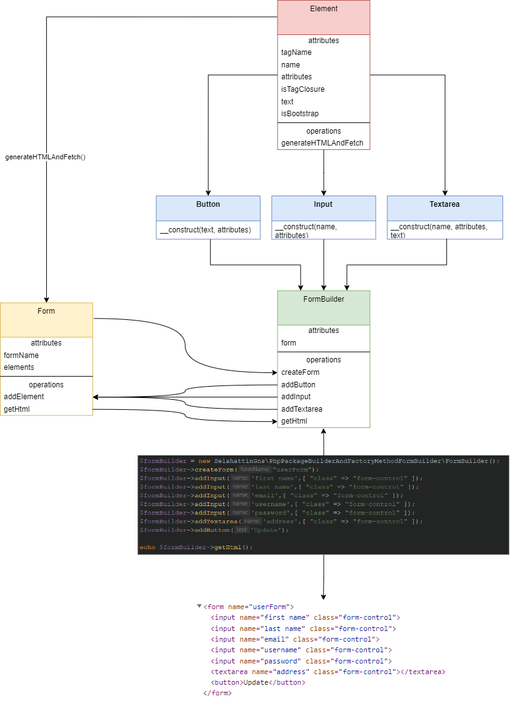

# Writing a php package using the builder and factory method

*Command;*
    
    composer install
    composer dump

*Example Usage (index.php);*
    
    $formBuilder = new SelahattinGns\PhpPackageBuilderAndFactoryMethodFormBuilder\FormBuilder();
    
    $formBuilder->createForm("userForm");
    $formBuilder->addInput('first name',[ "class" => "form-control" ]);
    $formBuilder->addInput('last name',[ "class" => "form-control" ]);
    $formBuilder->addInput('email',[ "class" => "form-control" ]);
    $formBuilder->addInput('username',[ "class" => "form-control" ]);
    $formBuilder->addInput('password',[ "class" => "form-control" ]);
    $formBuilder->addTextarea('address',[ "class" => "form-control" ]);
    $formBuilder->addButton('Update');

    echo $formBuilder->getHtml();

---

**Structure and Output;**

